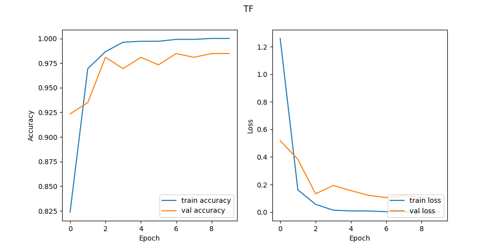

# Automatic_Signal_Detector


## Abstract
In this project, there are two parts:
- create hands dataset
- train model to recognize hands (Here, implemented three models: MLP, CNN, Transfer Learning)

## Getting Started
Get code: `git clone https://github.com/Zhijie-He/Automatic_Signal_Detector.git`

## Running the code

Create hands dataset

```bash
python create_hands_dataset [A-Z]
```
- `--[A-Z]` specifies the signal name.

Select the face capture by type "y"
After decide the face bounding, type "y" to create hand dataset according to the hands gesture(Signal_Language).


Train model to recoginze
```bash
python main model_name
```
- `model_name` specifies the model name, can select from MLP, CNN and TF.

## Hands dataset example


## Different ways to detect face

### Common way to detect faces using Haar Cascades


### Optimization by seraching subregion 


### MeanShift


### CamShift 


## Model Performance

<h3>MLP</h3>


<h3>CNN</h3>


<h3>Transfer Learning</h3>

