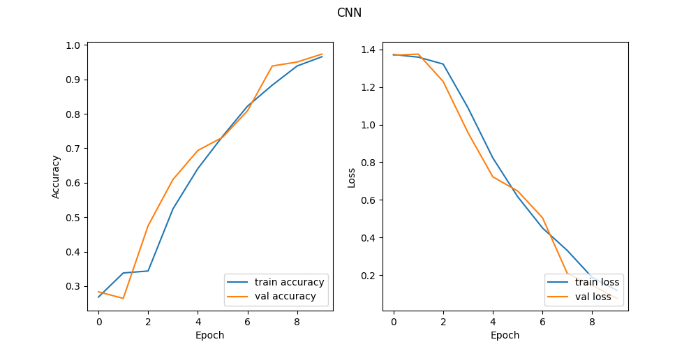

# Automatic_Signal_Detector

<p align="center">
   
</p>

## Abstract
In this project, there are two parts:
- Create hands dataset
- Train model to recognize hands (Here, implemented three models: MLP, CNN, Transfer Learning)

In order to create hands dataset, we need to find a way to detect our hands. There are some pattern detecting faces and eyes. Given that patterns, we use Camshift algorithm to detect hands by setting face region probability to zero, and then it's likely that hands is the most likely region to be detected.

## Getting Started
Clone the repository.

```
git clone https://github.com/Zhijie-He/Automatic_Signal_Detector.git
```

Goto the cloned folder.
```
cd Automatic_Signal_Detector
```

## Steps to run Code

```
### For Linux Users
python3 -m venv psestenv
source psestenv/bin/activate

### For Window Users
python3 -m venv psestenv
cd psestenv
cd Scripts
activate
cd ..
cd ..
```

Install requirements with mentioned command below.

```
pip install -r requirements.txt
```


Create hands dataset

```bash
python create_hands_dataset [A-Z]
```
- `--[A-Z]` specifies the signal name.

Select the face capture by type "y"

After decide the face bounding, type "y" to create hand dataset according to the hands gesture(Signal_Language).


<p align="center">
   
</p>

Train model to recoginze signal language, see model performance below
```bash
python main model_name
```
- `model_name` specifies the model name, can select from MLP, CNN and TF.

## Hands dataset example

<p align="center">
   
</p>


## Different ways to detect face

<table>
  <tr>
    <td>Common way to detect faces using Haar Cascades</td>
     <td>Optimization by seraching subregion </td>
     <td>MeanShift</td>
     <td>CamShift </td>
  </tr>
  <tr>
    <td></td>
    <td></td>
    <td></td>
    <td></td>
  </tr>
 </table>


## Model Performance


<h3>MLP</h3>


<h3>CNN</h3>



<h3>Transfer Learning</h3>

